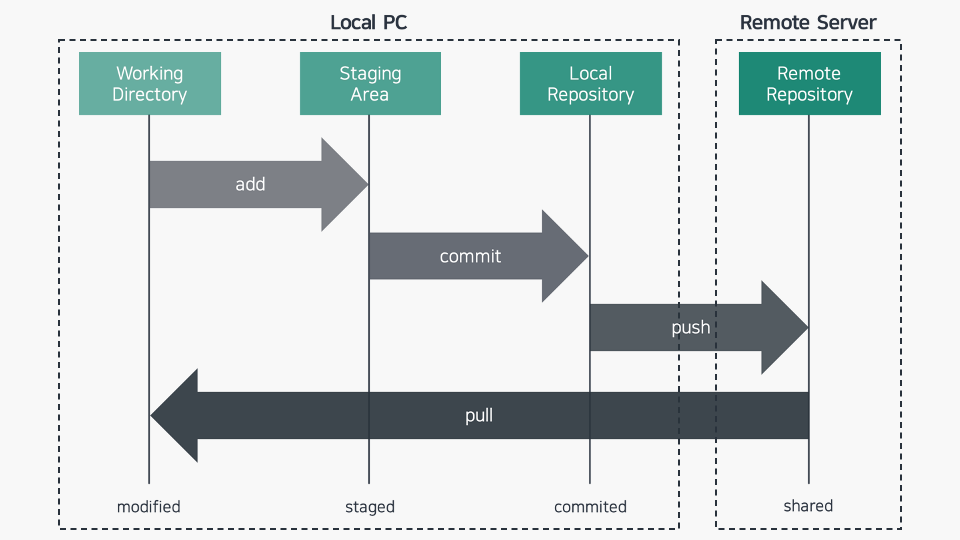
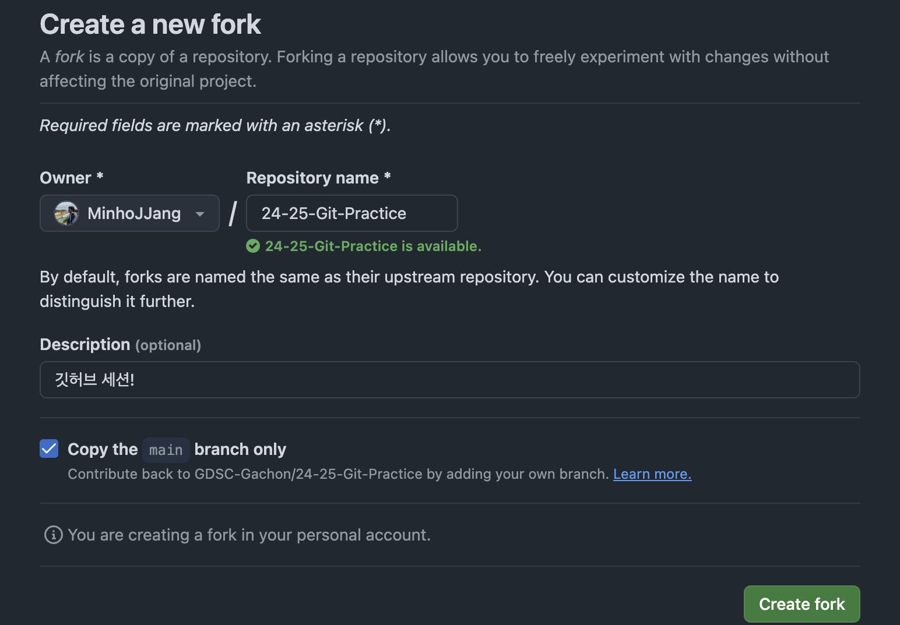

# 🌱 [LV100] 깃과 함께 떠나는 버전 관리 여행!

**시나리오:** 여러분은 이제 막 신입 개발자로 입사하여, "맛집 지도" 프로젝트에 참여하게 되었습니다. 팀원들과 함께 프로젝트를 진행하며 깃과 깃허브를 이용하여 효율적인 코드 관리를 경험해 봅시다!


## 🌳 1단계: 깃과 깃허브, 너희의 정체는?

**🌳 1.1 깃(Git)이 뭔가요?**

깃은 소스 코드를 효율적으로 관리하기 위해 개발된 **분산 버전 관리 시스템**입니다.

- **버전 관리?** 파일의 변경 이력을 추적하여 특정 시점의 버전으로 되돌아갈 수 있도록 합니다.
- **분산 관리?** 중앙 서버뿐만 아니라 로컬 컴퓨터에도 전체 저장소 히스토리가 저장됩니다.

**🤝 깃을 사용하면 좋은 점:**

- 여러 사람이 동시에 작업하고 변경 사항을 병합하기 용이합니다.
- 실수로 코드를 삭제하거나 잘못 수정해도 쉽게 복구할 수 있습니다.
- 코드 변경 이력을 통해 누가, 언제, 왜 코드를 변경했는지 추적할 수 있습니다.

**🌳 1.2 깃허브(GitHub)는 또 뭐죠?**

깃허브는 깃 저장소 호스팅을 제공하는 웹 기반 서비스입니다.

- 깃허브는 깃 저장소를 온라인에 저장하고 관리하는 공간을 제공합니다.
- 협업 도구를 제공하여 여러 사람이 함께 프로젝트를 진행하기 용이합니다.
- 오픈소스 프로젝트 참여를 위한 플랫폼을 제공합니다.

**🌳 1.3 깃의 3가지 영역: Working Directory, Staging Area, Repository**

깃은 파일의 버전을 관리하기 위해 세 가지 주요 영역을 사용합니다. 이러한 영역을 이해하는 것은 깃을 효과적으로 사용하는 데 매우 중요합니다.

1. **Working Directory (작업 디렉토리):** 프로젝트 파일을 수정하고 작업하는 공간입니다. 우리가 눈으로 보고 편집하는 실제 파일들이 있는 곳입니다.
2. **Staging Area (스테이징 영역):** 커밋을 준비하는 공간입니다. 작업 디렉토리에서 변경된 파일 중, 다음 커밋에 포함할 파일들을 선택적으로 추가하는 공간입니다. `git add` 명령어를 사용하여 변경된 파일들을 스테이징 영역에 추가합니다.
3. **Repository (저장소):** 커밋된 모든 스냅샷이 저장되는 공간입니다. 로컬 저장소와 원격 저장소로 나뉘며,
    - **로컬 저장소 (Local Repository):** 사용자의 컴퓨터에 존재하는 저장소입니다.
    - **원격 저장소 (Remote Repository):** 깃허브와 같은 서버에 존재하는 저장소입니다.

**🤔 세 영역의 관계는?**

작업 디렉토리에서 파일을 수정하고, `git add` 명령어를 사용하여 수정된 파일을 스테이징 영역에 추가합니다. 그리고 `git commit` 명령어를 사용하여 스테이징 영역에 있는 변경 사항들을 로컬 저장소에 커밋합니다. 마지막으로 `git push` 명령어를 사용하여 로컬 저장소의 변경 사항을 원격 저장소에 반영합니다.

**📊 그림으로 이해하기**


**🤔 깃과 깃허브, 무슨 관계일까요?**

깃은 버전 관리 시스템이고, 깃허브는 깃 저장소를 호스팅하는 서비스입니다. 즉, 깃은 도구이고, 깃허브는 그 도구를 사용하는 공간이라고 생각하면 됩니다!

---

## 🏕️ 2단계: 깃 초기 설정, 나를 소개하지!

**🏕️ 2.1 깃 환경 설정: 나를 깃에게 소개하기!**

깃을 사용하기 전에, 깃에게 나의 이름과 이메일 주소를 알려줘야 합니다. 마치 여행을 떠나기 전, 비행기 티켓에 내 정보를 기록하는 것과 같은 이치랍니다! ✈️  이 정보는 우리가 변경한 내용(커밋)을 누가 작성했는지 식별하는 데 사용됩니다. 

터미널을 열고 다음 명령어를 실행하여 깃에게 나를 소개해 봅시다. 

```bash
git config --global user.name "본인의 깃허브 사용자 이름"
git config --global user.email "본인의 깃허브 이메일 주소"
```

**💡 `--global` 옵션: 전 세계 어디서든 나를 알아봐!**

`--global` 옵션은 마치 내 정보가 담긴 여권과 같아서, 이 옵션을 사용하면 내 컴퓨터의 모든 깃 프로젝트에서 나의 정보를 사용할 수 있습니다. 만약 특정 프로젝트에서만 다른 정보를 사용하고 싶다면, 해당 프로젝트 폴더에서 `--global` 옵션 없이 명령어를 실행하면 됩니다! 

**🔍 설정 확인: 깃이 내 정보를 제대로 기억하는지 확인!**

다음 명령어를 실행하여 깃이 나의 정보를 잘 기억하고 있는지 확인할 수 있습니다.

```bash
git config --list
```

**⚠️  만약 이 과정을 건너뛴다면?**

깃은 우리가 변경한 내용을 누가 작업했는지 알 수 없어 혼란스러워할 거예요! 😵  심지어 커밋 자체가 불가능해져서, 협업은 물론이고 버전 관리 자체를 할 수 없게 됩니다.  따라서 깃을 사용하기 전에 반드시 이름과 이메일 주소를 설정해 주세요! 


---

### 🌲 3단계: 깃 기본 명령어, 이제 실전이다!

**드디어 "맛집 지도" 프로젝트에 첫 발을 내딛는 순간입니다!**

**🌲 3.0 fork : 내 저장소로 포크하기**

깃허브에는 다른 사람의 저장소를 자신의 계정으로 복사해와서 자유롭게 수정하고 학습할 수 있는 fork 기능이 있습니다. "맛집 지도" 프로젝트를 시작하기 전에, 먼저 GDSC-Gachon/24-25-Git-Practice 저장소를 포크하여 내 저장소로 가져와 봅시다.

1. [**https://github.com/GDSC-Gachon/24-25-Git-Practice**](https://github.com/GDSC-Gachon/24-25-Git-Practice) 저장소 페이지로 이동합니다.
2. 페이지 오른쪽 상단에 있는 "Fork" 버튼을 클릭합니다.
3. 포크된 저장소를 어디에 위치시킬지 선택하고 "Create fork" 버튼을 클릭합니다.



**🌲 3.1 git clone : 프로젝트 저장소 복제하기**

이제 막 포크한 "맛집 지도" 프로젝트 저장소를 복제하여 내 컴퓨터로 가져와 봅시다.

1. 깃허브에서 방금 포크한 "맛집 지도" 프로젝트 저장소 페이지로 이동합니다. (본인의 깃허브 계정에 존재합니다)
2. "Code" 버튼을 클릭하고 "HTTPS" 탭을 선택합니다.
3. 저장소 URL을 복사합니다.
4. 터미널을 열고 프로젝트를 저장할 폴더로 이동합니다.
5. 다음 명령어를 실행하여 저장소를 복제합니다.
    ```bash
    git clone 복사한 저장소 URL
    ```

**🌲 3.2 나만의 맛집 폴더 만들고 파일 채우기**

자, 이제 나만의 맛집 정보를 관리할 폴더를 만들어 볼까요? 마치 여행 중 발견한 맛집 리스트를 개인 노트에 따로 정리하는 것과 같아요! 📝

1. **개인 맛집 폴더 생성:** 
`LV100 - 맛집 지도` 폴더 안에서 본인의 이름으로 된 폴더를 하나 만들어 줍니다. 예를 들어, 이름이 "철수" 라면,
   ```bash
   mkdir 철수
   ```

2. **맛집 파일 복사하기:**
`1번맛집.txt` 와 `2번맛집.txt` 파일을 방금 만든 개인 폴더로 복사해 줍니다. 

3. **맛집 정보 수정:**
   * 이제 `철수` 폴더로 이동한 후, 두 맛집 파일을 열어 자유롭게 맛집 정보를 수정해봅시다!
   * 각 파일에는 아래처럼 맛집 정보가 적혀 있을 거예요.  원하는 대로 내용을 바꿔서 저장해 보세요!
     ```
     // 1번맛집.txt
     - 맛집 이름: (가고 싶은 맛집 이름)
     - 메뉴: (가장 좋아하는 메뉴)
     - 위치: (맛집이 있는 곳)

     // 2번맛집.txt
     - 맛집 이름: (가고 싶은 맛집 이름)
     - 메뉴: (가장 좋아하는 메뉴)
     - 위치: (맛집이 있는 곳)
     ```

이제 나만의 맛집 정보가 담긴 파일들이 준비되었네요! 다음 단계부터 본격적으로 Git을 이용하여 이 파일들을 관리해 보겠습니다. 😄 

**🌲 3.3 `git status` : 변경 사항 확인**

파일을 생성하고 수정한 후, 깃 저장소의 상태를 확인해 봅시다.

```bash
git status
```

`git status` 명령어를 실행하면 아직 깃이 추적하고 있지 않은 파일 목록이 빨간색으로 표시될 것입니다.

**🌲 3.4 `git add` : 변경 사항 스테이징 영역에 추가**

새롭게 생성하거나 수정한 파일들을 깃이 추적하도록 스테이징 영역에 추가해 줍니다.

```bash
git add 1번맛집.txt 2번맛집.txt
```

혹은, 모든 변경 사항을 추가하고 싶다면 다음 명령어를 사용합니다.

```bash
git add .
```

**🌲 3.5 `git commit` : 변경 사항 커밋하기**

스테이징 영역에 추가된 변경 사항들을 하나의 버전으로 묶어서 커밋 메시지와 함께 로컬 저장소에 저장합니다.

```bash
git commit -m "맛집 정보 추가"
```

- `m` 옵션 뒤에는 어떤 변경 사항을 반영했는지 설명하는 커밋 메시지를 간략하게 작성합니다.

**🌲 3.6 `git push` : 원격 저장소에 반영하기**

로컬 저장소에 커밋한 내용을 깃허브 원격 저장소에 반영합니다.

```bash
git push origin main
```

`origin`은 원격 저장소의 이름, `main`은 브랜치 이름입니다.

**🌲 3.7  `git branch`, `git checkout`: 새로운 브랜치 생성 및 이동**

"추가 메뉴 정보"를 추가하는 기능을 개발하기 위해 `feature/add-menu` 라는 새로운 브랜치를 생성하고 이동해 봅시다.

```bash
git branch feature/add-menu
git checkout feature/add-menu
```

**🌲 3.8 `1번맛집.txt` 수정**

`feature/add-menu` 브랜치에서 `1번맛집.txt` 파일에 "추가 메뉴 정보"를 추가해 봅시다.

**예시:**

```
// 1번맛집.txt
- 맛집 이름: 청춘 돼지집
- 메뉴: 숙성 삼겹살, 된장찌개 // 메뉴 추가
- 위치: 서울 강남구 역삼동
```

**🌲 3.9 `git diff` : 변경 사항 비교**

수정된 내용을 이전 버전과 비교해 봅시다.

```bash
git diff
```

`git diff` 명령어를 실행하면 수정된 부분이 하이라이트 되어 표시됩니다.

**🌲 3.10 변경 사항 커밋 및 원격 저장소에 반영**

수정된 내용을 커밋하고 원격 저장소에 반영합니다.

```bash
git add 1번맛집.txt
git commit -m "추가 메뉴 정보 추가"
git push origin feature/add-menu
```

**🌲 3.11 `git pull`: 원격 저장소 변경 사항 가져오기**

다른 팀원이 원격 저장소에 새로운 기능을 추가했거나 변경 사항이 발생했다고 가정해 봅시다. 로컬 저장소에 해당 변경 사항을 반영하여, 최신 상태를 유지하기 위해 `git pull` 명령어를 사용합니다. 마치 여행 중에 다른 팀원이 보낸 단체 메시지를 확인하는 것과 같습니다! 💬

```bash
git checkout main
git pull origin main
```

**🌲 3.12 `Fork`한 레포지토리, 원본 레포지토리에 반영하기**

내가 작업한 내용을 원본 레포지토리에 반영하고 싶다면, **Pull Request (PR)** 라는 것을 보내야 합니다. 마치 여행 중 찍은 멋진 사진을 공유 앨범에 업로드하는 것과 같습니다! 🏞️

**1. 변경 사항 확인:**

* 깃허브 웹사이트에서 내가 포크한 저장소 페이지로 이동합니다. 
* "Pull requests" 탭을 클릭하고, "New pull request" 버튼을 클릭합니다.
* "compare" 부분에서  `base repository` 는 원본 저장소를, `head repository` 는 내 포크한 저장소를 선택합니다.
* 변경된 내용을 최종적으로 확인합니다.

**2. Pull Request 생성:**

* "Create pull request" 버튼을 클릭합니다.
* PR 제목과 내용을 작성합니다. 어떤 내용을 변경했는지 자세하게 설명하면, 다른 사람들이 내가 작업한 내용을 쉽게 이해할 수 있습니다.
* "Create pull request" 버튼을 클릭하여 PR을 생성합니다.

**3. 기다림의 시간:**

PR을 생성하면 원본 저장소 관리자가 내가 요청한 내용을 검토하고 병합할지 결정합니다. 

---

**🎉 축하합니다! 이제 깃과 깃허브의 기본적인 사용법을 익혔습니다!**  

앞으로 깃과 깃허브를 이용하여 팀원들과 함께 멋진 프로젝트를 만들어나가 보세요! 🚀 

### Next: [[LV 200]](https://github.com/GDSC-Gachon/24-25-Git-Practice/blob/main/LV200%20-%20%ED%98%91%EC%97%85%EC%9D%98%20%EC%8B%9C%EC%9E%91/README.md)
